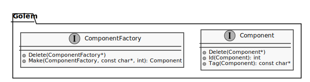
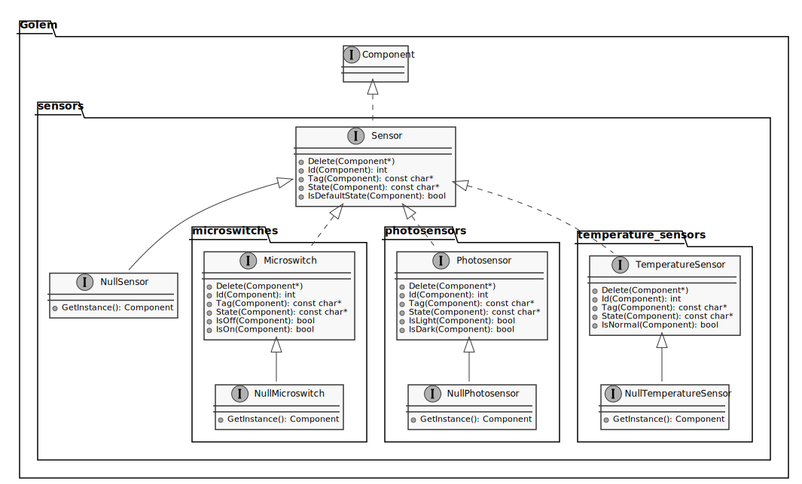

# Golem   

Golem is an open source library for electromechanical components.

## Overview

- Written in C
- For embedded systems
- Every feature comes with tests
- Developer Friendly
- MIT license

## Features

- Component
  - Actuator
    - Motor
      - Pluse motor
    - Solenoid
  - Display
    - Led
      - Led array
    - Seven-segment display
  - Sensor
    - Microswitch
    - Photosensor
    - Temperature sensor

## Implementation

### Class diagram

#### Component

#### Actuator

#### Display

#### Sensor

#### Command

